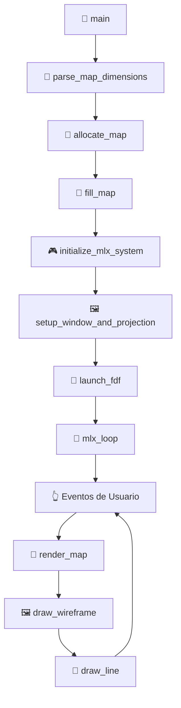
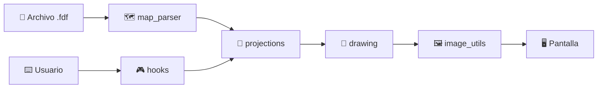

# 📐 FdF (Fil de Fer) - Documentación Completa del Proyecto

## 🎯 Descripción General

**FdF** (Fil de Fer, "hilo de hierro" en francés) es un proyecto de 42 que consiste en crear un visor de mapas topográficos en 3D utilizando la librería MiniLibX. El programa lee un archivo que contiene una matriz de altitudes y las representa como un wireframe (estructura de alambre) en proyección isométrica.

---

## 🏗️ Arquitectura del Proyecto

```
📁 source/
├── 🚀 main.c                    # Punto de entrada y coordinación general
├── 📄 fdf.h                     # Definiciones, estructuras y prototipos
├── 🗺️  map_parser.c             # Análisis y lectura de archivos de mapa
├── 🔧 parsing_utils.c           # Utilidades para parsing
├── 🎨 drawing.c                 # Motor de renderizado principal
├── 📐 projections.c             # Cálculos de proyección 3D→2D
├── 🎮 hooks.c                   # Gestión de eventos de usuario
├── 🌈 colors.c                  # Sistema de interpolación de colores
├── 🎨 color_utils.c             # Utilidades para manejo de colores
├── 🖼️  image_utils.c            # Gestión de buffer de imagen
├── 📏 bresenham_utils.c         # Algoritmo de líneas de Bresenham
├── 🧹 memory_utils.c            # Gestión de memoria
├── 🔧 utils.c                   # Funciones auxiliares generales
└── 📚 libft/                    # Librería personal de funciones C
```

---

## 📊 Estructuras de Datos Principales

### 🗺️ `t_map` - Punto del Mapa
```c
typedef struct s_map {
    int x, y, z;                // Coordenadas 3D originales
    unsigned int color;         // Color del punto
    int screen_x, screen_y;     // Coordenadas 2D proyectadas
} t_map;
```

### 📐 `t_projection` - Parámetros de Proyección
```c
typedef struct s_projection {
    float zoom;                 // Factor de escala
    int offset_x, offset_y;     // Desplazamiento en pantalla
    float elevation;            // Factor de elevación del eje Z
} t_projection;
```

### 🖥️ `t_vars` - Estado Global de la Aplicación
```c
typedef struct s_vars {
    void *mlx, *win, *img;      // Elementos de MiniLibX
    char *addr;                 // Buffer de imagen
    t_map **map;                // Matriz bidimensional del mapa
    int height, width;          // Dimensiones del mapa
    t_projection projection;    // Parámetros de proyección
    // ... otros campos para gestión de imagen
} t_vars;
```

---

## 🔄 Flujo de Ejecución Principal



---

## 📖 Análisis Detallado por Módulos

### 🚀 1. **main.c** - Coordinador Principal

**Propósito:** Punto de entrada que orquesta todo el proceso de inicialización y lanzamiento.

#### 🔧 Funciones principales:

- **`main()`**: Valida argumentos y coordina el flujo completo
- **`initialize_mlx_system()`**: Configura MiniLibX
- **`setup_window_and_projection()`**: Establece ventana y parámetros gráficos
- **`launch_fdf()`**: Inicia renderizado y loop de eventos
- **`handle_init_error()`**: Gestión centralizada de errores

#### 📊 Flujo de datos:
```
argv[1] (archivo) → parse_map_dimensions() → allocate_map() → 
fill_map() → initialize_mlx_system() → setup_window_and_projection() → 
launch_fdf() → mlx_loop()
```

---

### 🗺️ 2. **map_parser.c** - Motor de Análisis de Mapas

**Propósito:** Lee e interpreta archivos de mapa, convirtiendo texto en estructuras de datos.

#### 🔧 Funciones principales:

- **`parse_map_dimensions()`**: 
  - Lee el archivo completo para determinar alto × ancho
  - Maneja archivos rectangulares de cualquier tamaño
  
- **`fill_map()`**: 
  - Llena la matriz `t_map` con datos del archivo
  - Convierte strings en coordenadas y colores

#### 📊 Ejemplo de transformación:
```
Archivo:        Estructura t_map:
"0 1 2"    →    map[0][0] = {x:0, y:0, z:0, color:DEFAULT}
"1 2 3"         map[0][1] = {x:1, y:0, z:1, color:DEFAULT}
                map[1][0] = {x:0, y:1, z:1, color:DEFAULT}
```

---

### 🔧 3. **parsing_utils.c** - Herramientas de Análisis

**Propósito:** Funciones especializadas para procesar elementos individuales del archivo.

#### 🔧 Funciones principales:

- **`parse_point_value()`**: 
  - Interpreta strings como "42" o "42,0xFF0000"
  - Separa altitud (z) y color hexadecimal
  
- **`validate_line_width()`**: 
  - Verifica consistencia del ancho del mapa
  - Previene errores de formato

#### 💡 Lógica de parsing:
```c
// "15,0xFF0000" se convierte en:
point->z = 15;                    // Altitud
point->color = 0xFF0000;          // Color rojo
```

---

### 📐 4. **projections.c** - Geometría 3D → 2D

**Propósito:** Convierte coordenadas 3D del mapa en coordenadas 2D de pantalla usando proyección isométrica.

#### 🔧 Funciones principales:

- **`isometric_projection()`**: 
  - Aplica transformación matemática 3D → 2D
  - Usa ángulo de 30° para efecto isométrico
  
- **`calculate_auto_zoom()`**: 
  - Calcula zoom óptimo para que el mapa quepa en ventana
  - Mantiene proporciones y deja margen
  
- **`calculate_window_size()`**: 
  - Determina tamaño de ventana basado en dimensiones del mapa

#### 🧮 Fórmula isométrica:
```c
screen_x = ((x - y) * cos(30°)) * zoom + offset_x
screen_y = ((x + y) * sin(30°) - z * elevation) * zoom + offset_y
```

#### 📊 Transformación visual:
```
Coordenadas 3D:     Proyección Isométrica:
     z                      
     ↑                        /y
     |                       /
     |___y                  /
    /                   x__/
   x
```

---

### 🎨 5. **drawing.c** - Motor de Renderizado

**Propósito:** Dibuja el wireframe completo conectando puntos adyacentes con líneas.

#### 🔧 Funciones principales:

- **`render_map()`**: 
  - Coordinador principal de renderizado
  - Limpia buffer → dibuja wireframe → muestra en pantalla
  
- **`draw_wireframe()`**: 
  - Conecta cada punto con sus vecinos (derecha y abajo)
  - Crea la estructura de "alambre"
  
- **`draw_line()`**: 
  - Implementa algoritmo de Bresenham
  - Incluye interpolación de color suave

#### 🖼️ Estrategia de doble buffer:
```
Buffer de imagen → Dibujo completo → mlx_put_image_to_window()
```
Esto evita parpadeo y mejora rendimiento.

---

### 📏 6. **bresenham_utils.c** - Algoritmo de Líneas

**Propósito:** Implementa el algoritmo de Bresenham para dibujar líneas pixel por pixel.

#### 🔧 Funciones principales:

- **`init_bresenham()`**: 
  - Calcula parámetros iniciales (dx, dy, direcciones)
  - Establece variables de error
  
- **`update_position()`**: 
  - Avanza un pixel en la dirección óptima
  - Mantiene la línea lo más recta posible

#### 💡 ¿Por qué Bresenham?
- Eficiente (solo operaciones enteras)
- Líneas suaves sin huecos
- Perfecto para gráficos de píxeles

---

### 🌈 7. **colors.c** & **color_utils.c** - Sistema de Colores

**Propósito:** Gestiona interpolación de colores para transiciones suaves entre puntos.

#### 🔧 Funciones principales:

- **`interp_color()`**: 
  - Interpola entre dos colores usando parámetro t (0.0 a 1.0)
  - Produce gradientes naturales
  
- **`create_color()`, `get_red()`, `get_green()`, `get_blue()`**: 
  - Utilidades para manipular componentes RGB

#### 🎨 Interpolación de color:
```
Color inicial (rojo): 0xFF0000
Color final (azul):   0x0000FF
t = 0.5 (50%):        0x800080 (púrpura)
```

---

### 🎮 8. **hooks.c** - Interactividad

**Propósito:** Gestiona la interacción del usuario con la aplicación.

#### 🔧 Funciones principales:

- **`key_hook()`**: 
  - Detecta teclas presionadas
  - Modifica parámetros de proyección en tiempo real
  
- **`setup_hooks()`**: 
  - Registra handlers de eventos en MiniLibX
  
- **`redraw()`**: 
  - Recalcula proyección y redibuja cuando cambian parámetros

#### ⌨️ Controles disponibles:
```
ESC: Salir
+/z: Acercar zoom
-/x: Alejar zoom
Flechas: Mover vista
```

---

### 🖼️ 9. **image_utils.c** - Gestión de Buffer

**Propósito:** Optimiza el renderizado usando buffer de imagen en lugar de píxeles individuales.

#### 🔧 Funciones principales:

- **`my_mlx_pixel_put()`**: 
  - Escribe directamente al buffer de imagen
  - Incluye verificación de límites
  
- **`init_image()`**: 
  - Crea imagen y obtiene acceso al buffer
  
- **`clear_image_buffer()`**: 
  - Limpia completamente el buffer (relleno con 0s)

#### ⚡ Ventajas del buffer:
- **Rendimiento**: Un solo llamado a pantalla vs miles
- **Suavidad**: Sin parpadeo durante redraw
- **Control**: Manipulación directa de píxeles

---

### 🧹 10. **memory_utils.c** - Gestión de Memoria

**Propósito:** Maneja asignación y liberación segura de memoria para estructuras complejas.

#### 🔧 Funciones principales:

- **`allocate_map()`**: 
  - Asigna matriz bidimensional `t_map**`
  - Maneja el patrón: array de punteros → arrays de estructuras
  
- **`free_map()`**: 
  - Libera sistemáticamente: filas individuales → array principal
  
- **`cleanup_split_array()`**: 
  - Libera arrays de strings (resultado de `ft_split`)

#### 🔒 Gestión de memoria segura:
```c
// Asignación:
map = malloc(height * sizeof(t_map*))     // Array de punteros
for each row: map[i] = malloc(width * sizeof(t_map))  // Cada fila

// Liberación (orden inverso):
for each row: free(map[i])                // Liberar filas
free(map)                                 // Liberar array principal
```

---

### 🔧 11. **utils.c** - Utilidades Generales

**Propósito:** Funciones auxiliares para limpieza y gestión de recursos.

#### 🔧 Funciones principales:

- **`free_map_and_resources()`**: 
  - Liberación completa y ordenada de todos los recursos
  - Imagen → Ventana → Display → Mapa
  
- **`clear_window()`**: 
  - Limpia contenido visual de la ventana

---

## 🔄 Interacciones Entre Módulos

### 📊 Flujo de datos principal:



### 🔗 Dependencias clave:

1. **main.c** coordina y usa prácticamente todos los módulos
2. **map_parser.c** depende de **parsing_utils.c** y **memory_utils.c**
3. **drawing.c** usa **bresenham_utils.c**, **colors.c** e **image_utils.c**
4. **hooks.c** modifica **projections.c** y trigger **drawing.c**

---

## 🎯 Casos de Uso y Escenarios

### 📝 1. Carga inicial del mapa:
```
main() → parse_map_dimensions() → allocate_map() → fill_map()
```

### 🎨 2. Renderizado de frame:
```
render_map() → clear_image_buffer() → draw_wireframe() → 
[para cada línea] draw_line() → my_mlx_pixel_put()
```

### 🎮 3. Interacción del usuario:
```
Tecla presionada → key_hook() → modificar projection → 
redraw() → isometric_projection() → render_map()
```

---

## ⚡ Optimizaciones y Características Técnicas

### 🚀 Rendimiento:
- **Buffer de imagen**: Una sola escritura a pantalla por frame
- **Proyección cacheable**: Solo recalcula cuando cambian parámetros
- **Bresenham optimizado**: Solo aritmética entera

### 🎨 Calidad visual:
- **Interpolación de colores**: Gradientes suaves entre puntos
- **Auto-zoom**: Mapa siempre visible independientemente del tamaño
- **Proyección isométrica**: Vista 3D convincente

### 🔒 Robustez:
- **Validación de archivos**: Verifica formato y consistencia
- **Gestión de memoria**: Liberación sistemática, sin leaks
- **Manejo de errores**: Cleanup apropiado en todos los casos de fallo

---

## 🧪 Ejemplo de Funcionamiento Completo

### 📄 Archivo de entrada (`test.fdf`):
```
0 0 1 2 3
0 1 2 3 4
1 2 3 4 5
```

### 🔄 Procesamiento paso a paso:

1. **Parse**: `3×5` mapa detectado
2. **Asignación**: Matriz `t_map[3][5]` creada
3. **Llenado**: Cada posición tiene coordenadas (x,y,z) y color
4. **Proyección**: Coordenadas 3D convertidas a screen_x/screen_y
5. **Renderizado**: Líneas dibujadas entre puntos adyacentes
6. **Display**: Frame mostrado en ventana
7. **Interactivo**: Usuario puede zoom/mover en tiempo real

---

## 🎓 Conclusión

El proyecto FdF demuestra conceptos fundamentales de:

- **🖥️ Programación gráfica**: Buffers, proyecciones, algoritmos de líneas
- **🧮 Geometría 3D**: Transformaciones matemáticas para visualización
- **🏗️ Arquitectura de software**: Modularización, separación de responsabilidades
- **🔧 Gestión de recursos**: Memoria, archivos, eventos del sistema
- **⚡ Optimización**: Técnicas para rendering eficiente

Este es un excelente ejemplo de cómo combinar múltiples disciplinas (matemáticas, gráficos, sistemas) en una aplicación cohesiva y funcional. El diseño modular facilita el mantenimiento y la extensibilidad, mientras que las optimizaciones implementadas garantizan una experiencia de usuario fluida.
