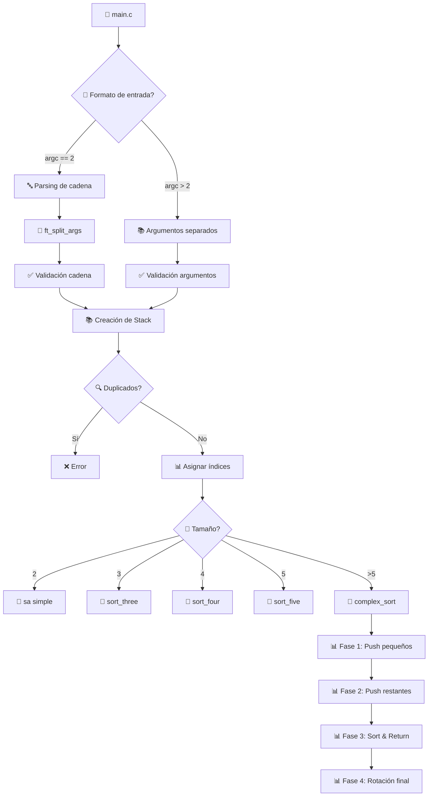
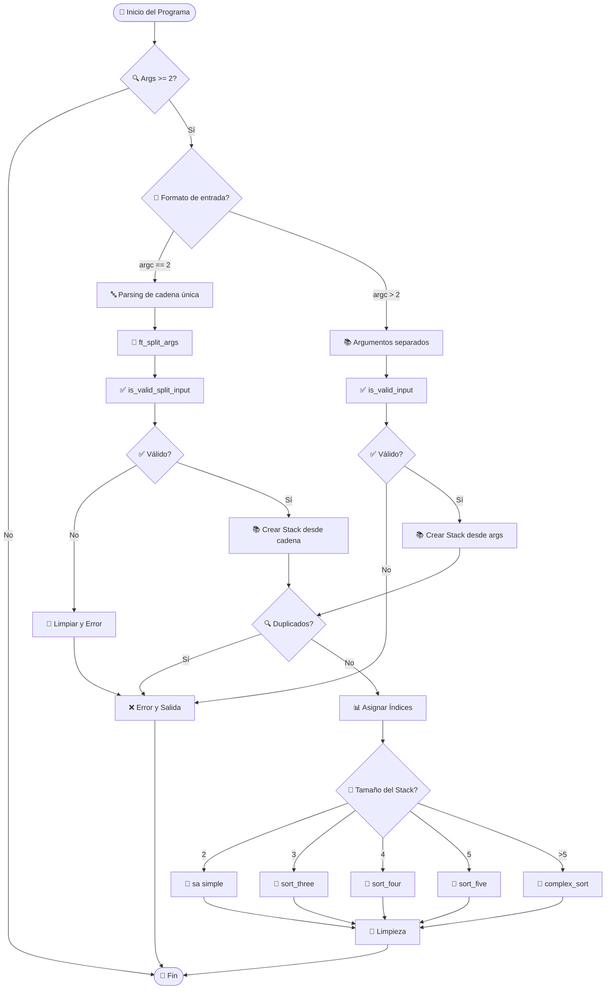
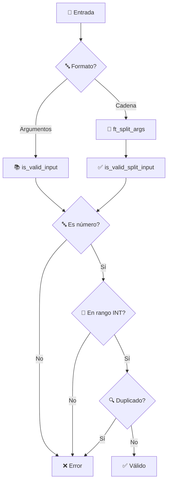
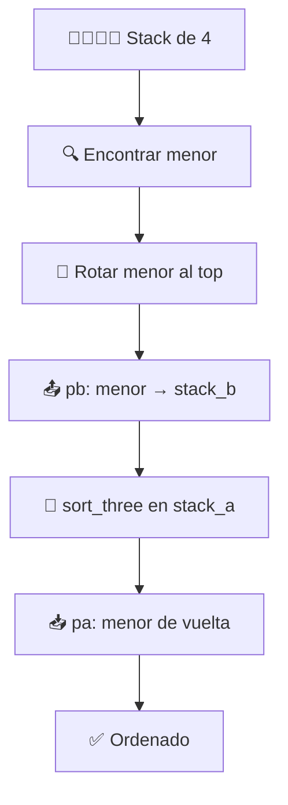
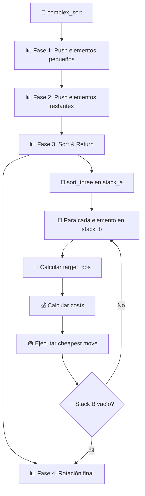

# 🔢 Push_Swap: Tutorial Completo y Análisis Técnico

## 📑 Índice
- [🏗️ Arquitectura General](#🏗️-arquitectura-general)
- [🔧 Estructuras de Datos](#🔧-estructuras-de-datos)  
- [🎯 Flujo de Ejecución](#🎯-flujo-de-ejecución)
- [📊 Análisis por Módulos](#📊-análisis-por-módulos)
- [🧮 Algoritmos Implementados](#🧮-algoritmos-implementados)
- [💰 Sistema de Costos](#💰-sistema-de-costos)
- [🔄 Operaciones Básicas](#🔄-operaciones-básicas)
- [⚡ Optimizaciones](#⚡-optimizaciones)
- [🧪 Casos de Uso](#🧪-casos-de-uso)
- [📚 Conceptos Técnicos](#📚-conceptos-técnicos)
- [🎯 Conclusión](#🎯-conclusión)

---

## 🏗️ Arquitectura General

### 📁 Estructura del Proyecto

```
push_swap/
├── 📋 push_swap.h          # Definiciones y prototipos
├── 🚀 main.c               # Punto de entrada principal
├── ✅ validation.c         # Validación de entrada
├── 📝 parsing.c            # Parsing de argumentos (nueva funcionalidad)
├── 🛠️ parsing_utils.c      # Utilidades para parsing de cadenas
├── 📚 stack_operations*.c  # Operaciones básicas de stack
├── 🔄 operations_*.c       # Operaciones push_swap (sa, sb, pa, pb, etc.)
├── 🎯 simple_sort.c        # Algoritmos para 2-5 elementos
├── 🧠 complex_sort.c       # Algoritmo principal (>5 elementos)
├── 📍 position.c           # Cálculo de posiciones y objetivos
├── 💰 cost*.c              # Sistema de cálculo de costos
├── 🎮 moves*.c             # Ejecución optimizada de movimientos
└── 🛠️ utils.c              # Funciones auxiliares
```

### 🏛️ Diagrama de Arquitectura



---

## 🔧 Estructuras de Datos

### 📚 Estructura Principal: `t_stack`

```c
typedef struct s_stack
{
    int             value;      // 🔢 Valor original del elemento
    int             index;      // 📊 Índice de ordenación (0 = menor)
    int             pos;        // 📍 Posición actual en el stack
    int             target_pos; // 🎯 Posición objetivo en stack destino
    int             cost_a;     // 💰 Costo de movimiento en stack A
    int             cost_b;     // 💰 Costo de movimiento en stack B
    struct s_stack  *next;      // 🔗 Puntero al siguiente elemento
}   t_stack;
```

#### 📊 Ejemplo de transformación:
```
Input: [4, 2, 7, 1, 3]
│
├── value:      [4, 2, 7, 1, 3]
├── index:      [2, 1, 4, 0, 3]  // 1=menor(0), 2=siguiente(1), etc.
├── pos:        [0, 1, 2, 3, 4]  // Posición actual
├── target_pos: [calculado dinámicamente]
├── cost_a:     [calculado dinámicamente]
└── cost_b:     [calculado dinámicamente]
```

---

## 🎯 Flujo de Ejecución

### 🔄 Flujo Principal Actualizado



### 📝 Proceso Detallado paso a paso

#### 1️⃣ **Inicialización y Detección de Formato**
```c
int main(int argc, char **argv) {
    t_stack *stack_a = NULL;
    t_stack *stack_b = NULL;
    
    if (argc < 2)
        return (0);
        
    // 🔍 Detectar formato de entrada
    if (argc == 2)
        stack_a = create_stack_from_string(argv[1]);  // "1 2 3 4"
    else
        stack_a = create_stack_from_args(argc, argv); // 1 2 3 4
}
```

#### 2️⃣ **Parsing de Cadena Única (NUEVA FUNCIONALIDAD)**
```c
static t_stack *create_stack_from_string(char *str) {
    t_stack *stack_a = NULL;
    char    **split_args;
    
    // 📝 Dividir cadena en tokens
    split_args = ft_split_args(str);
    
    // ✅ Validar formato de tokens
    if (!split_args || !is_valid_split_input(split_args)) {
        free_split_args(split_args);
        return (NULL);
    }
    
    // 📚 Crear stack desde array de strings
    // Resultado: soporte para "./push_swap "5 4 7 8 1 12""
}
```

#### 3️⃣ **Validación Dual**
```c
// ✅ Para argumentos separados
if (!is_valid_input(argc, argv))
    return (NULL);

// ✅ Para cadena dividida  
if (!is_valid_split_input(split_args))
    return (NULL);
```

#### 4️⃣ **Asignación de Índices**
```c
void assign_index(t_stack *stack_a, int stack_size) {
    // 📊 Convierte valores a índices de ordenación
    // [4, 2, 7, 1, 3] → índices [2, 1, 4, 0, 3]
    // 1(menor)=0, 2=1, 3=2, 4=3, 7(mayor)=4
}
```

#### 5️⃣ **Selección de Algoritmo**
```c
void push_swap(t_stack **stack_a, t_stack **stack_b, int stack_size) {
    if (stack_size == 2 && !is_sorted(*stack_a))
        sa(stack_a, 1);                    // 🎯 Simple
    else if (stack_size == 3)
        sort_three(stack_a);               // 🎯 3 elementos
    else if (stack_size == 4)
        sort_four(stack_a, stack_b);       // 🎯 4 elementos  
    else if (stack_size == 5)
        sort_five(stack_a, stack_b);       // 🎯 5 elementos
    else if (stack_size > 5)
        complex_sort(stack_a, stack_b);    // 🧠 Algoritmo complejo
}
```

---

## 📊 Análisis por Módulos

### 🚀 main.c - Punto de Entrada (ACTUALIZADO)
**Responsabilidades:**
- 🔍 Detección automática del formato de entrada
- 📝 Parsing de cadenas con espacios
- 📚 Construcción del stack desde múltiples formatos
- 🎯 Delegación al algoritmo apropiado
- 🧹 Gestión de memoria y limpieza
- 🐛 Funciones de depuración (debug)

**Funciones principales:**
```c
int main(int argc, char **argv);                    // 🚀 Función principal
static t_stack *create_stack_from_args(int argc, char **argv);   // 📚 Desde argumentos
static t_stack *create_stack_from_string(char *str);             // 📝 Desde cadena
void push_swap(t_stack **a, t_stack **b, int size);              // 🎯 Controlador
```

**Mejoras implementadas:**
- ✅ Soporte dual: `./push_swap 1 2 3` y `./push_swap "1 2 3"`
- ✅ Validación específica para cada formato
- ✅ Gestión de memoria optimizada para parsing
- ✅ Detección automática del formato de entrada

### 📝 parsing.c & parsing_utils.c - Sistema de Parsing (NUEVO)
**Responsabilidades:**
- 🔤 División de cadenas con múltiples espacios
- ✅ Validación específica para tokens
- 🧹 Gestión de memoria para arrays dinámicos
- 🔧 Utilidades de conversión y validación

**Funciones principales:**
```c
char **ft_split_args(char *str);                    // 📝 Dividir cadena
int is_valid_split_input(char **split_args);        // ✅ Validar tokens
void free_split_args(char **split_args);            // 🧹 Liberar memoria
```

### ✅ validation.c - Validación de Entrada (AMPLIADO)
**Responsabilidades:**
- 🔍 Verificar que los argumentos sean números válidos
- 📏 Validar rango de enteros (INT_MIN a INT_MAX)
- 🔄 Detectar números duplicados
- 🔢 Conversión segura string → int
- 📝 Validación específica para cadenas parseadas

**Flujo de validación dual:**


### 📚 stack_operations.c/stack_operations2.c - Gestión de Stacks
**Responsabilidades:**
- 🏗️ Creación de nuevos nodos
- ➕ Inserción en el stack
- 📏 Cálculo de tamaño
- 🔍 Navegación (último, penúltimo elemento)
- 🧹 Liberación de memoria
- ✅ Verificación de ordenación

**Operaciones clave:**
```c
t_stack *new_stack(int value);              // 🏗️ Crear nodo
void stack_add_back(t_stack **stack, t_stack *new); // ➕ Añadir al final
int get_stack_size(t_stack *stack);         // 📏 Obtener tamaño
void free_stack(t_stack *stack);            // 🧹 Liberar memoria
int is_sorted(t_stack *stack);              // ✅ Verificar orden
```

### 🔄 operations_*.c - Operaciones Push_Swap
**Responsabilidades:**
- 🔀 Implementar las 11 operaciones básicas
- 📢 Imprimir comandos (cuando `print = 1`)
- 🛡️ Validar precondiciones
- ⚡ Ejecutar operaciones atómicas

**Las 11 operaciones:**
```c
// 🔀 Intercambios
void sa(t_stack **stack_a, int print);     // Swap A
void sb(t_stack **stack_b, int print);     // Swap B  
void ss(t_stack **stack_a, t_stack **stack_b, int print); // Swap ambos

// 📤📥 Push/Pop
void pa(t_stack **stack_a, t_stack **stack_b, int print); // Push a A
void pb(t_stack **stack_a, t_stack **stack_b, int print); // Push a B

// 🔄 Rotaciones hacia arriba
void ra(t_stack **stack_a, int print);     // Rotate A
void rb(t_stack **stack_b, int print);     // Rotate B
void rr(t_stack **stack_a, t_stack **stack_b, int print); // Rotate ambos

// 🔄⬅️ Rotaciones hacia abajo  
void rra(t_stack **stack_a, int print);    // Reverse rotate A
void rrb(t_stack **stack_b, int print);    // Reverse rotate B
void rrr(t_stack **stack_a, t_stack **stack_b, int print); // Reverse ambos
```

### 🎯 simple_sort.c - Algoritmos Simples
**Responsabilidades:**
- 🎯 Algoritmos optimizados para 2-5 elementos
- 🧮 Casos específicos hardcodeados
- ⚡ Mínimo número de operaciones
- 🏃‍♂️ Ejecución directa sin cálculos complejos

### 🧠 complex_sort.c - Algoritmo Principal
**Responsabilidades:**
- 🧠 Algoritmo "cheapest move" para >5 elementos
- 📊 División en 4 fases optimizadas
- 🎯 Minimizar número total de operaciones
- 📈 Escalabilidad para grandes conjuntos

### 📍 position.c - Cálculo de Posiciones
**Responsabilidades:**
- 📍 Asignar posiciones actuales en stacks
- 🎯 Calcular posiciones objetivo
- 🔍 Encontrar elemento más pequeño
- 🧮 Determinar ubicaciones óptimas

### 💰 cost.c/cost_utils.c - Sistema de Costos
**Responsabilidades:**
- 💰 Calcular costo de cada movimiento posible
- 🔍 Encontrar el movimiento más económico
- ⚖️ Considerar optimizaciones combinadas (rr, rrr)
- 📊 Comparar alternativas

### 🎮 moves.c/moves2.c - Ejecución de Movimientos
**Responsabilidades:**
- 🎮 Ejecutar secuencias de movimientos optimizadas
- ⚡ Combinar operaciones cuando es posible
- 🔄 Gestionar rotaciones simultáneas
- 🎯 Aplicar el movimiento más económico

---

## 🧮 Algoritmos Implementados

### 🎯 Algoritmos Simples (2-5 elementos)

#### 📊 Complejidad y Características
- **Temporal**: O(1) - Número fijo de operaciones
- **Espacial**: O(1) - Solo usan los stacks dados
- **Estrategia**: Casos hardcodeados con secuencias óptimas
- **Ventaja**: Garantizan el mínimo absoluto de operaciones

#### 🔢 Algoritmo para 2 elementos
```c
if (stack_size == 2 && !is_sorted(*stack_a))
    sa(stack_a, 1);  // Una sola operación
```

#### 🔢🔢🔢 Algoritmo para 3 elementos
```c
void sort_three(t_stack **stack_a) {
    // 🎯 6 casos posibles, cada uno con solución óptima
    int first = (*stack_a)->index;
    int second = (*stack_a)->next->index; 
    int third = (*stack_a)->next->next->index;
    
    // Casos optimizados:
    if (first > second && second < third && first < third)
        sa(stack_a, 1);                    // [2,1,3] → sa
    else if (first > second && second > third)
        { sa(stack_a, 1); rra(stack_a, 1); }  // [3,2,1] → sa + rra
    // ... más casos
}
```

#### 🔢🔢🔢🔢 Algoritmo para 4 elementos


#### 🔢🔢🔢🔢🔢 Algoritmo para 5 elementos
Similar al de 4, pero mueve los **2 menores** a stack_b:
1. 🔍 Mover el menor a stack_b
2. 🔍 Mover el segundo menor a stack_b  
3. 🎯 Ordenar 3 elementos restantes
4. 📥 Devolver elementos en orden

### 🧠 Algoritmo Complejo (>5 elementos)

#### 📊 Características Principales
- **Temporal**: O(n²) en peor caso, O(n log n) promedio
- **Espacial**: O(1) - Solo usa los 2 stacks dados
- **Estrategia**: "Cheapest Move" - siempre elige la opción más económica
- **Fases**: 4 fases optimizadas

#### 🏗️ Arquitectura del Algoritmo


#### 📊 Fase 1: Push Elementos Pequeños
```c
static void push_small_elements(t_stack **stack_a, t_stack **stack_b) {
    int size = get_stack_size(*stack_a);
    int pushed = 0;
    
    // 🎯 Mover elementos con índice <= size/2 a stack_b
    while (size > 6 && pushed < size / 2) {
        if ((*stack_a)->index <= size / 2) {
            pb(stack_a, stack_b, 1);  // 📤 Mover a stack_b
            pushed++;
        } else {
            ra(stack_a, 1);           // 🔄 Rotar para encontrar siguiente
        }
    }
}
```

#### 📊 Fase 2: Push Elementos Restantes
```c
static void push_remaining_elements(t_stack **stack_a, t_stack **stack_b) {
    // 🎯 Mover todos excepto los 3 más grandes
    while (get_stack_size(*stack_a) > 3) {
        pb(stack_a, stack_b, 1);
    }
    // 📊 Resultado: stack_a tiene los 3 elementos más grandes
}
```

#### 📊 Fase 3: Sort & Return (Núcleo del algoritmo)
```c
static void sort_and_return_elements(t_stack **stack_a, t_stack **stack_b) {
    sort_three(stack_a);  // 🎯 Ordenar base de 3 elementos
    
    while (*stack_b) {
        assign_target_positions(stack_a, stack_b);  // 📍 Calcular objetivos
        get_cost(stack_a, stack_b);                 // 💰 Calcular costos
        do_cheapest_move(stack_a, stack_b);         // 🎮 Ejecutar óptimo
    }
}
```

#### 📊 Fase 4: Rotación Final
```c
static void final_rotation(t_stack **stack_a) {
    // 🔄 Posicionar el elemento menor en el top
    int pos = get_lowest_index_position(stack_a);
    
    if (pos < get_stack_size(*stack_a) / 2) {
        // 🔄 Rotar hacia arriba (ra)
        while (pos--) ra(stack_a, 1);
    } else {
        // 🔄⬅️ Rotar hacia abajo (rra) - más eficiente
        pos = get_stack_size(*stack_a) - pos;
        while (pos--) rra(stack_a, 1);
    }
}
```

---

## 💰 Sistema de Costos

### 📊 Filosofía del Sistema de Costos

El algoritmo **"cheapest move"** evalúa todas las opciones posibles y siempre ejecuta la que requiere menos operaciones totales.

### 📊 Cálculo de Costos Individual

#### 💰 Costo para Stack A
```c
static void get_cost_a(t_stack **stack_a, t_stack **stack_b) {
    t_stack *tmp_a = *stack_a;
    t_stack *tmp_b = *stack_b;
    int size_a = get_stack_size(*stack_a);
    
    while (tmp_b) {
        // 💰 Calcular costo para llevar target_pos al top
        if (tmp_b->target_pos < size_a / 2) {
            tmp_b->cost_a = tmp_b->target_pos;        // 🔄 ra (positivo)
        } else {
            tmp_b->cost_a = -(size_a - tmp_b->target_pos); // 🔄⬅️ rra (negativo)
        }
        tmp_b = tmp_b->next;
    }
}
```

#### 💰 Costo para Stack B  
```c
static void get_cost_b(t_stack **stack_b) {
    t_stack *tmp_b = *stack_b;
    int size_b = get_stack_size(*stack_b);
    
    while (tmp_b) {
        // 💰 Calcular costo para llevar elemento al top de stack_b
        if (tmp_b->pos < size_b / 2) {
            tmp_b->cost_b = tmp_b->pos;              // 🔄 rb (positivo)
        } else {
            tmp_b->cost_b = -(size_b - tmp_b->pos);  // 🔄⬅️ rrb (negativo)
        }
        tmp_b = tmp_b->next;
    }
}
```

### ⚖️ Cálculo de Costo Total

```c
static int calculate_total_cost(int cost_a, int cost_b) {
    int abs_cost_a = (cost_a < 0) ? -cost_a : cost_a;
    int abs_cost_b = (cost_b < 0) ? -cost_b : cost_b;
    
    // 🎯 Mismo signo: se pueden combinar operaciones (rr/rrr)
    if ((cost_a < 0 && cost_b < 0) || (cost_a >= 0 && cost_b >= 0)) {
        return (abs_cost_a > abs_cost_b) ? abs_cost_a : abs_cost_b;
    }
    // 🎯 Signos diferentes: operaciones separadas
    else {
        return abs_cost_a + abs_cost_b;
    }
}
```

### 🎯 Selección del Movimiento Más Económico

```c
static void do_cheapest_move(t_stack **stack_a, t_stack **stack_b) {
    t_stack *tmp = *stack_b;
    t_stack *cheapest = NULL;
    int lowest_cost = INT_MAX;
    int current_cost;
    
    // 🔍 Encontrar movimiento más barato
    while (tmp) {
        current_cost = calculate_total_cost(tmp->cost_a, tmp->cost_b);
        if (current_cost < lowest_cost) {
            lowest_cost = current_cost;
            cheapest = tmp;
        }
        tmp = tmp->next;
    }
    
    // 🎮 Ejecutar movimiento óptimo
    do_move(stack_a, stack_b, cheapest->cost_a, cheapest->cost_b);
}
```

---

## 🔄 Operaciones Básicas

### 📊 Clasificación de Operaciones

| Tipo | Operaciones | Función | Complejidad |
|------|-------------|---------|-------------|
| 🔀 **Swap** | `sa`, `sb`, `ss` | Intercambiar 2 primeros | O(1) |
| 📤📥 **Push** | `pa`, `pb` | Mover elemento entre stacks | O(1) |
| 🔄 **Rotate** | `ra`, `rb`, `rr` | Rotar hacia arriba | O(1) |
| 🔄⬅️ **Reverse** | `rra`, `rrb`, `rrr` | Rotar hacia abajo | O(1) |

### 🎯 Optimizaciones en Operaciones

#### ⚡ Operaciones Combinadas
```c
// 🎯 En lugar de: ra + rb (2 operaciones)
// ✅ Usar: rr (1 operación)
void rr(t_stack **stack_a, t_stack **stack_b, int print) {
    if (*stack_a && (*stack_a)->next && *stack_b && (*stack_b)->next) {
        rotate(stack_a);
        rotate(stack_b);
        if (print)
            ft_putstr("rr\n");
    }
}
```

#### 🧠 Lógica de Decisión
```c
static void do_move(t_stack **a, t_stack **b, int cost_a, int cost_b) {
    // 🎯 Mismo signo: usar operaciones combinadas
    if (cost_a > 0 && cost_b > 0)
        do_rr_moves(a, b, &cost_a, &cost_b);    // rr
    else if (cost_a < 0 && cost_b < 0)
        do_rrr_moves(a, b, &cost_a, &cost_b);   // rrr
    
    // 🎯 Ejecutar movimientos restantes por separado
    do_ra_moves(a, cost_a);
    do_rb_moves(b, cost_b);
    
    // 📥 Finalmente: mover elemento
    pa(a, b, 1);
}
```

---

## ⚡ Optimizaciones

### 🎯 Optimizaciones en Algoritmos Simples

#### 🔢🔢🔢 Casos Hardcodeados para 3 elementos
```c
void sort_three(t_stack **stack_a) {
    // 🎯 Solo 6 permutaciones posibles → 6 casos optimizados
    //// filepath: exercises/project/project_documentation.md
# 🔢 Push_Swap: Tutorial Completo y Análisis Técnico

## 📑 Índice
- [🏗️ Arquitectura General](#🏗️-arquitectura-general)
- [🔧 Estructuras de Datos](#🔧-estructuras-de-datos)  
- [🎯 Flujo de Ejecución](#🎯-flujo-de-ejecución)
- [📊 Análisis por Módulos](#📊-análisis-por-módulos)
- [🧮 Algoritmos Implementados](#🧮-algoritmos-implementados)
- [💰 Sistema de Costos](#💰-sistema-de-costos)
- [🔄 Operaciones Básicas](#🔄-operaciones-básicas)
- [⚡ Optimizaciones](#⚡-optimizaciones)
- [🧪 Casos de Uso](#🧪-casos-de-uso)
- [📚 Conceptos Técnicos](#📚-conceptos-técnicos)
- [🎯 Conclusión](#🎯-conclusión)

---

## 🏗️ Arquitectura General

### 📁 Estructura del Proyecto

```
push_swap/
├── 📋 push_swap.h          # Definiciones y prototipos
├── 🚀 main.c               # Punto de entrada principal
├── ✅ validation.c         # Validación de entrada
├── 📝 parsing.c            # Parsing de argumentos (nueva funcionalidad)
├── 🛠️ parsing_utils.c      # Utilidades para parsing de cadenas
├── 📚 stack_operations*.c  # Operaciones básicas de stack
├── 🔄 operations_*.c       # Operaciones push_swap (sa, sb, pa, pb, etc.)
├── 🎯 simple_sort.c        # Algoritmos para 2-5 elementos
├── 🧠 complex_sort.c       # Algoritmo principal (>5 elementos)
├── 📍 position.c           # Cálculo de posiciones y objetivos
├── 💰 cost*.c              # Sistema de cálculo de costos
├── 🎮 moves*.c             # Ejecución optimizada de movimientos
└── 🛠️ utils.c              # Funciones auxiliares
```

### 🏛️ Diagrama de Arquitectura


---

## 🔧 Estructuras de Datos

### 📚 Estructura Principal: `t_stack`

```c
typedef struct s_stack
{
    int             value;      // 🔢 Valor original del elemento
    int             index;      // 📊 Índice de ordenación (0 = menor)
    int             pos;        // 📍 Posición actual en el stack
    int             target_pos; // 🎯 Posición objetivo en stack destino
    int             cost_a;     // 💰 Costo de movimiento en stack A
    int             cost_b;     // 💰 Costo de movimiento en stack B
    struct s_stack  *next;      // 🔗 Puntero al siguiente elemento
}   t_stack;
```

#### 📊 Ejemplo de transformación:
```
Input: [4, 2, 7, 1, 3]
│
├── value:      [4, 2, 7, 1, 3]
├── index:      [2, 1, 4, 0, 3]  // 1=menor(0), 2=siguiente(1), etc.
├── pos:        [0, 1, 2, 3, 4]  // Posición actual
├── target_pos: [calculado dinámicamente]
├── cost_a:     [calculado dinámicamente]
└── cost_b:     [calculado dinámicamente]
```

---

## 🎯 Flujo de Ejecución

### 🔄 Flujo Principal Actualizado


### 📝 Proceso Detallado paso a paso

#### 1️⃣ **Inicialización y Detección de Formato**
```c
int main(int argc, char **argv) {
    t_stack *stack_a = NULL;
    t_stack *stack_b = NULL;
    
    if (argc < 2)
        return (0);
        
    // 🔍 Detectar formato de entrada
    if (argc == 2)
        stack_a = create_stack_from_string(argv[1]);  // "1 2 3 4"
    else
        stack_a = create_stack_from_args(argc, argv); // 1 2 3 4
}
```

#### 2️⃣ **Parsing de Cadena Única (NUEVA FUNCIONALIDAD)**
```c
static t_stack *create_stack_from_string(char *str) {
    t_stack *stack_a = NULL;
    char    **split_args;
    
    // 📝 Dividir cadena en tokens
    split_args = ft_split_args(str);
    
    // ✅ Validar formato de tokens
    if (!split_args || !is_valid_split_input(split_args)) {
        free_split_args(split_args);
        return (NULL);
    }
    
    // 📚 Crear stack desde array de strings
    // Resultado: soporte para "./push_swap "5 4 7 8 1 12""
}
```

#### 3️⃣ **Validación Dual**
```c
// ✅ Para argumentos separados
if (!is_valid_input(argc, argv))
    return (NULL);

// ✅ Para cadena dividida  
if (!is_valid_split_input(split_args))
    return (NULL);
```

#### 4️⃣ **Asignación de Índices**
```c
void assign_index(t_stack *stack_a, int stack_size) {
    // 📊 Convierte valores a índices de ordenación
    // [4, 2, 7, 1, 3] → índices [2, 1, 4, 0, 3]
    // 1(menor)=0, 2=1, 3=2, 4=3, 7(mayor)=4
}
```

#### 5️⃣ **Selección de Algoritmo**
```c
void push_swap(t_stack **stack_a, t_stack **stack_b, int stack_size) {
    if (stack_size == 2 && !is_sorted(*stack_a))
        sa(stack_a, 1);                    // 🎯 Simple
    else if (stack_size == 3)
        sort_three(stack_a);               // 🎯 3 elementos
    else if (stack_size == 4)
        sort_four(stack_a, stack_b);       // 🎯 4 elementos  
    else if (stack_size == 5)
        sort_five(stack_a, stack_b);       // 🎯 5 elementos
    else if (stack_size > 5)
        complex_sort(stack_a, stack_b);    // 🧠 Algoritmo complejo
}
```

---

## 📊 Análisis por Módulos

### 🚀 main.c - Punto de Entrada (ACTUALIZADO)
**Responsabilidades:**
- 🔍 Detección automática del formato de entrada
- 📝 Parsing de cadenas con espacios
- 📚 Construcción del stack desde múltiples formatos
- 🎯 Delegación al algoritmo apropiado
- 🧹 Gestión de memoria y limpieza
- 🐛 Funciones de depuración (debug)

**Funciones principales:**
```c
int main(int argc, char **argv);                    // 🚀 Función principal
static t_stack *create_stack_from_args(int argc, char **argv);   // 📚 Desde argumentos
static t_stack *create_stack_from_string(char *str);             // 📝 Desde cadena
void push_swap(t_stack **a, t_stack **b, int size);              // 🎯 Controlador
```

**Mejoras implementadas:**
- ✅ Soporte dual: `./push_swap 1 2 3` y `./push_swap "1 2 3"`
- ✅ Validación específica para cada formato
- ✅ Gestión de memoria optimizada para parsing
- ✅ Detección automática del formato de entrada

### 📝 parsing.c & parsing_utils.c - Sistema de Parsing (NUEVO)
**Responsabilidades:**
- 🔤 División de cadenas con múltiples espacios
- ✅ Validación específica para tokens
- 🧹 Gestión de memoria para arrays dinámicos
- 🔧 Utilidades de conversión y validación

**Funciones principales:**
```c
char **ft_split_args(char *str);                    // 📝 Dividir cadena
int is_valid_split_input(char **split_args);        // ✅ Validar tokens
void free_split_args(char **split_args);            // 🧹 Liberar memoria
```

### ✅ validation.c - Validación de Entrada (AMPLIADO)
**Responsabilidades:**
- 🔍 Verificar que los argumentos sean números válidos
- 📏 Validar rango de enteros (INT_MIN a INT_MAX)
- 🔄 Detectar números duplicados
- 🔢 Conversión segura string → int
- 📝 Validación específica para cadenas parseadas

**Flujo de validación dual:**


### 📚 stack_operations.c/stack_operations2.c - Gestión de Stacks
**Responsabilidades:**
- 🏗️ Creación de nuevos nodos
- ➕ Inserción en el stack
- 📏 Cálculo de tamaño
- 🔍 Navegación (último, penúltimo elemento)
- 🧹 Liberación de memoria
- ✅ Verificación de ordenación

**Operaciones clave:**
```c
t_stack *new_stack(int value);              // 🏗️ Crear nodo
void stack_add_back(t_stack **stack, t_stack *new); // ➕ Añadir al final
int get_stack_size(t_stack *stack);         // 📏 Obtener tamaño
void free_stack(t_stack *stack);            // 🧹 Liberar memoria
int is_sorted(t_stack *stack);              // ✅ Verificar orden
```

### 🔄 operations_*.c - Operaciones Push_Swap
**Responsabilidades:**
- 🔀 Implementar las 11 operaciones básicas
- 📢 Imprimir comandos (cuando `print = 1`)
- 🛡️ Validar precondiciones
- ⚡ Ejecutar operaciones atómicas

**Las 11 operaciones:**
```c
// 🔀 Intercambios
void sa(t_stack **stack_a, int print);     // Swap A
void sb(t_stack **stack_b, int print);     // Swap B  
void ss(t_stack **stack_a, t_stack **stack_b, int print); // Swap ambos

// 📤📥 Push/Pop
void pa(t_stack **stack_a, t_stack **stack_b, int print); // Push a A
void pb(t_stack **stack_a, t_stack **stack_b, int print); // Push a B

// 🔄 Rotaciones hacia arriba
void ra(t_stack **stack_a, int print);     // Rotate A
void rb(t_stack **stack_b, int print);     // Rotate B
void rr(t_stack **stack_a, t_stack **stack_b, int print); // Rotate ambos

// 🔄⬅️ Rotaciones hacia abajo  
void rra(t_stack **stack_a, int print);    // Reverse rotate A
void rrb(t_stack **stack_b, int print);    // Reverse rotate B
void rrr(t_stack **stack_a, t_stack **stack_b, int print); // Reverse ambos
```

### 🎯 simple_sort.c - Algoritmos Simples
**Responsabilidades:**
- 🎯 Algoritmos optimizados para 2-5 elementos
- 🧮 Casos específicos hardcodeados
- ⚡ Mínimo número de operaciones
- 🏃‍♂️ Ejecución directa sin cálculos complejos

### 🧠 complex_sort.c - Algoritmo Principal
**Responsabilidades:**
- 🧠 Algoritmo "cheapest move" para >5 elementos
- 📊 División en 4 fases optimizadas
- 🎯 Minimizar número total de operaciones
- 📈 Escalabilidad para grandes conjuntos

### 📍 position.c - Cálculo de Posiciones
**Responsabilidades:**
- 📍 Asignar posiciones actuales en stacks
- 🎯 Calcular posiciones objetivo
- 🔍 Encontrar elemento más pequeño
- 🧮 Determinar ubicaciones óptimas

### 💰 cost.c/cost_utils.c - Sistema de Costos
**Responsabilidades:**
- 💰 Calcular costo de cada movimiento posible
- 🔍 Encontrar el movimiento más económico
- ⚖️ Considerar optimizaciones combinadas (rr, rrr)
- 📊 Comparar alternativas

### 🎮 moves.c/moves2.c - Ejecución de Movimientos
**Responsabilidades:**
- 🎮 Ejecutar secuencias de movimientos optimizadas
- ⚡ Combinar operaciones cuando es posible
- 🔄 Gestionar rotaciones simultáneas
- 🎯 Aplicar el movimiento más económico

---

## 🧮 Algoritmos Implementados

### 🎯 Algoritmos Simples (2-5 elementos)

#### 📊 Complejidad y Características
- **Temporal**: O(1) - Número fijo de operaciones
- **Espacial**: O(1) - Solo usan los stacks dados
- **Estrategia**: Casos hardcodeados con secuencias óptimas
- **Ventaja**: Garantizan el mínimo absoluto de operaciones

#### 🔢 Algoritmo para 2 elementos
```c
if (stack_size == 2 && !is_sorted(*stack_a))
    sa(stack_a, 1);  // Una sola operación
```

#### 🔢🔢🔢 Algoritmo para 3 elementos
```c
void sort_three(t_stack **stack_a) {
    // 🎯 6 casos posibles, cada uno con solución óptima
    int first = (*stack_a)->index;
    int second = (*stack_a)->next->index; 
    int third = (*stack_a)->next->next->index;
    
    // Casos optimizados:
    if (first > second && second < third && first < third)
        sa(stack_a, 1);                    // [2,1,3] → sa
    else if (first > second && second > third)
        { sa(stack_a, 1); rra(stack_a, 1); }  // [3,2,1] → sa + rra
    // ... más casos
}
```

#### 🔢🔢🔢🔢 Algoritmo para 4 elementos


#### 🔢🔢🔢🔢🔢 Algoritmo para 5 elementos
Similar al de 4, pero mueve los **2 menores** a stack_b:
1. 🔍 Mover el menor a stack_b
2. 🔍 Mover el segundo menor a stack_b  
3. 🎯 Ordenar 3 elementos restantes
4. 📥 Devolver elementos en orden

### 🧠 Algoritmo Complejo (>5 elementos)

#### 📊 Características Principales
- **Temporal**: O(n²) en peor caso, O(n log n) promedio
- **Espacial**: O(1) - Solo usa los 2 stacks dados
- **Estrategia**: "Cheapest Move" - siempre elige la opción más económica
- **Fases**: 4 fases optimizadas

#### 🏗️ Arquitectura del Algoritmo


#### 📊 Fase 1: Push Elementos Pequeños
```c
static void push_small_elements(t_stack **stack_a, t_stack **stack_b) {
    int size = get_stack_size(*stack_a);
    int pushed = 0;
    
    // 🎯 Mover elementos con índice <= size/2 a stack_b
    while (size > 6 && pushed < size / 2) {
        if ((*stack_a)->index <= size / 2) {
            pb(stack_a, stack_b, 1);  // 📤 Mover a stack_b
            pushed++;
        } else {
            ra(stack_a, 1);           // 🔄 Rotar para encontrar siguiente
        }
    }
}
```

#### 📊 Fase 2: Push Elementos Restantes
```c
static void push_remaining_elements(t_stack **stack_a, t_stack **stack_b) {
    // 🎯 Mover todos excepto los 3 más grandes
    while (get_stack_size(*stack_a) > 3) {
        pb(stack_a, stack_b, 1);
    }
    // 📊 Resultado: stack_a tiene los 3 elementos más grandes
}
```

#### 📊 Fase 3: Sort & Return (Núcleo del algoritmo)
```c
static void sort_and_return_elements(t_stack **stack_a, t_stack **stack_b) {
    sort_three(stack_a);  // 🎯 Ordenar base de 3 elementos
    
    while (*stack_b) {
        assign_target_positions(stack_a, stack_b);  // 📍 Calcular objetivos
        get_cost(stack_a, stack_b);                 // 💰 Calcular costos
        do_cheapest_move(stack_a, stack_b);         // 🎮 Ejecutar óptimo
    }
}
```

#### 📊 Fase 4: Rotación Final
```c
static void final_rotation(t_stack **stack_a) {
    // 🔄 Posicionar el elemento menor en el top
    int pos = get_lowest_index_position(stack_a);
    
    if (pos < get_stack_size(*stack_a) / 2) {
        // 🔄 Rotar hacia arriba (ra)
        while (pos--) ra(stack_a, 1);
    } else {
        // 🔄⬅️ Rotar hacia abajo (rra) - más eficiente
        pos = get_stack_size(*stack_a) - pos;
        while (pos--) rra(stack_a, 1);
    }
}
```

---

## 💰 Sistema de Costos

### 📊 Filosofía del Sistema de Costos

El algoritmo **"cheapest move"** evalúa todas las opciones posibles y siempre ejecuta la que requiere menos operaciones totales.

### 📊 Cálculo de Costos Individual

#### 💰 Costo para Stack A
```c
static void get_cost_a(t_stack **stack_a, t_stack **stack_b) {
    t_stack *tmp_a = *stack_a;
    t_stack *tmp_b = *stack_b;
    int size_a = get_stack_size(*stack_a);
    
    while (tmp_b) {
        // 💰 Calcular costo para llevar target_pos al top
        if (tmp_b->target_pos < size_a / 2) {
            tmp_b->cost_a = tmp_b->target_pos;        // 🔄 ra (positivo)
        } else {
            tmp_b->cost_a = -(size_a - tmp_b->target_pos); // 🔄⬅️ rra (negativo)
        }
        tmp_b = tmp_b->next;
    }
}
```

#### 💰 Costo para Stack B  
```c
static void get_cost_b(t_stack **stack_b) {
    t_stack *tmp_b = *stack_b;
    int size_b = get_stack_size(*stack_b);
    
    while (tmp_b) {
        // 💰 Calcular costo para llevar elemento al top de stack_b
        if (tmp_b->pos < size_b / 2) {
            tmp_b->cost_b = tmp_b->pos;              // 🔄 rb (positivo)
        } else {
            tmp_b->cost_b = -(size_b - tmp_b->pos);  // 🔄⬅️ rrb (negativo)
        }
        tmp_b = tmp_b->next;
    }
}
```

### ⚖️ Cálculo de Costo Total

```c
static int calculate_total_cost(int cost_a, int cost_b) {
    int abs_cost_a = (cost_a < 0) ? -cost_a : cost_a;
    int abs_cost_b = (cost_b < 0) ? -cost_b : cost_b;
    
    // 🎯 Mismo signo: se pueden combinar operaciones (rr/rrr)
    if ((cost_a < 0 && cost_b < 0) || (cost_a >= 0 && cost_b >= 0)) {
        return (abs_cost_a > abs_cost_b) ? abs_cost_a : abs_cost_b;
    }
    // 🎯 Signos diferentes: operaciones separadas
    else {
        return abs_cost_a + abs_cost_b;
    }
}
```

### 🎯 Selección del Movimiento Más Económico

```c
static void do_cheapest_move(t_stack **stack_a, t_stack **stack_b) {
    t_stack *tmp = *stack_b;
    t_stack *cheapest = NULL;
    int lowest_cost = INT_MAX;
    int current_cost;
    
    // 🔍 Encontrar movimiento más barato
    while (tmp) {
        current_cost = calculate_total_cost(tmp->cost_a, tmp->cost_b);
        if (current_cost < lowest_cost) {
            lowest_cost = current_cost;
            cheapest = tmp;
        }
        tmp = tmp->next;
    }
    
    // 🎮 Ejecutar movimiento óptimo
    do_move(stack_a, stack_b, cheapest->cost_a, cheapest->cost_b);
}
```

---

## 🔄 Operaciones Básicas

### 📊 Clasificación de Operaciones

| Tipo | Operaciones | Función | Complejidad |
|------|-------------|---------|-------------|
| 🔀 **Swap** | `sa`, `sb`, `ss` | Intercambiar 2 primeros | O(1) |
| 📤📥 **Push** | `pa`, `pb` | Mover elemento entre stacks | O(1) |
| 🔄 **Rotate** | `ra`, `rb`, `rr` | Rotar hacia arriba | O(1) |
| 🔄⬅️ **Reverse** | `rra`, `rrb`, `rrr` | Rotar hacia abajo | O(1) |

### 🎯 Optimizaciones en Operaciones

#### ⚡ Operaciones Combinadas
```c
// 🎯 En lugar de: ra + rb (2 operaciones)
// ✅ Usar: rr (1 operación)
void rr(t_stack **stack_a, t_stack **stack_b, int print) {
    if (*stack_a && (*stack_a)->next && *stack_b && (*stack_b)->next) {
        rotate(stack_a);
        rotate(stack_b);
        if (print)
            ft_putstr("rr\n");
    }
}
```

#### 🧠 Lógica de Decisión
```c
static void do_move(t_stack **a, t_stack **b, int cost_a, int cost_b) {
    // 🎯 Mismo signo: usar operaciones combinadas
    if (cost_a > 0 && cost_b > 0)
        do_rr_moves(a, b, &cost_a, &cost_b);    // rr
    else if (cost_a < 0 && cost_b < 0)
        do_rrr_moves(a, b, &cost_a, &cost_b);   // rrr
    
    // 🎯 Ejecutar movimientos restantes por separado
    do_ra_moves(a, cost_a);
    do_rb_moves(b, cost_b);
    
    // 📥 Finalmente: mover elemento
    pa(a, b, 1);
}
```

---

## ⚡ Optimizaciones

### 🎯 Optimizaciones en Algoritmos Simples

#### 🔢🔢🔢 Casos Hardcodeados para 3 elementos
```c
void sort_three(t_stack **stack_a) {
    // 🎯 Solo 6 permutaciones posibles → 6 casos optimizados
    //