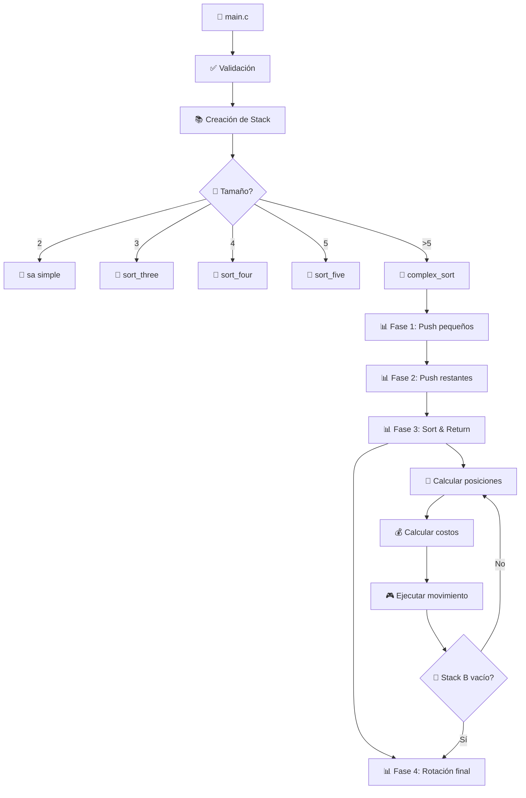
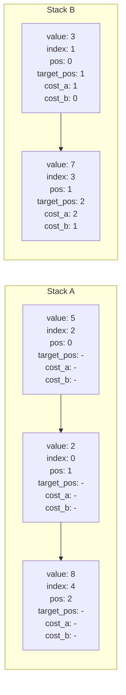
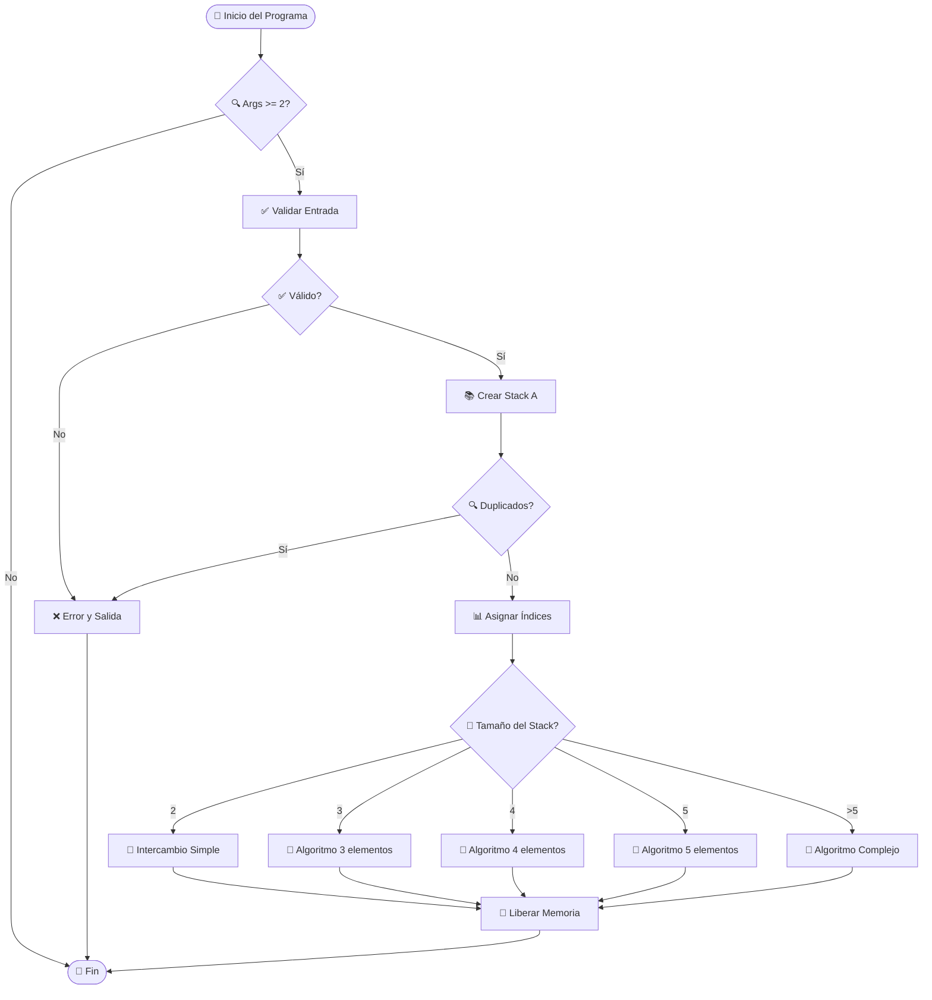
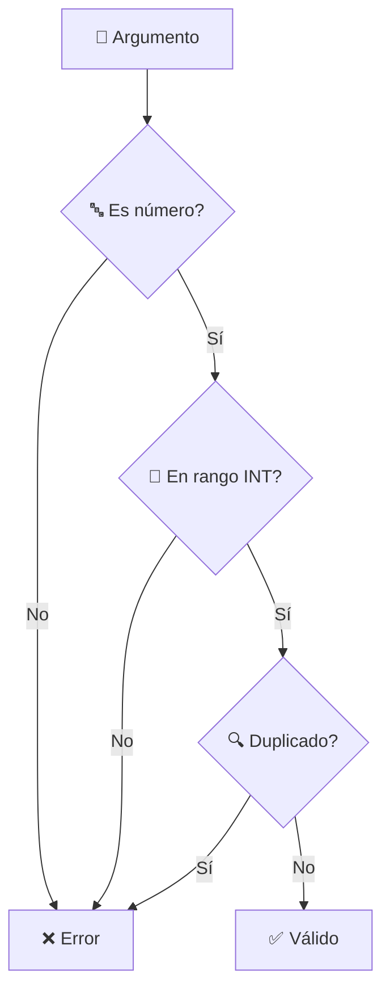
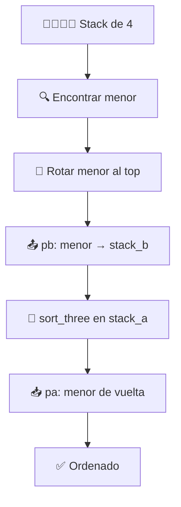
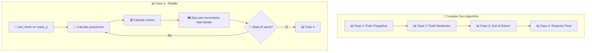
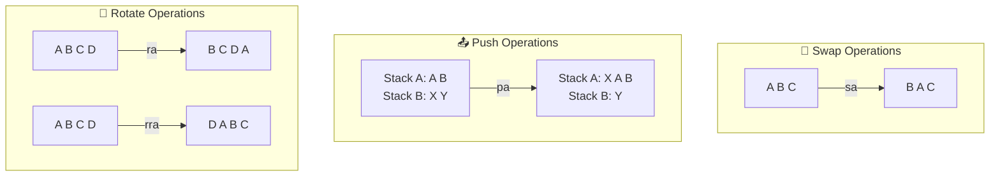

# 🔢 Push_Swap: Tutorial Completo y Análisis Técnico

## 📑 Índice
- [🏗️ Arquitectura General](#🏗️-arquitectura-general)
- [🔧 Estructuras de Datos](#🔧-estructuras-de-datos)  
- [🎯 Flujo de Ejecución](#🎯-flujo-de-ejecución)
- [📊 Análisis por Módulos](#📊-análisis-por-módulos)
- [🧮 Algoritmos Implementados](#🧮-algoritmos-implementados)
- [💰 Sistema de Costos](#💰-sistema-de-costos)
- [🔄 Operaciones Básicas](#🔄-operaciones-básicas)
- [⚡ Optimizaciones](#⚡-optimizaciones)
- [🧪 Casos de Uso](#🧪-casos-de-uso)
- [📚 Conceptos Técnicos](#📚-conceptos-técnicos)

---

## 🏗️ Arquitectura General

### 📁 Estructura del Proyecto

```
push_swap/
├── 📋 push_swap.h          # Definiciones y prototipos
├── 🚀 main.c               # Punto de entrada principal
├── ✅ validation.c         # Validación de entrada
├── 📚 stack_operations*.c  # Operaciones básicas de stack
├── 🔄 operations_*.c       # Operaciones push_swap (sa, sb, pa, pb, etc.)
├── 🎯 simple_sort.c        # Algoritmos para 2-5 elementos
├── 🧠 complex_sort.c       # Algoritmo principal (>5 elementos)
├── 📍 position.c           # Cálculo de posiciones y objetivos
├── 💰 cost*.c              # Sistema de cálculo de costos
├── 🎮 moves*.c             # Ejecución optimizada de movimientos
└── 🛠️ utils.c              # Funciones auxiliares
```

### 🏛️ Diagrama de Arquitectura



---

## 🔧 Estructuras de Datos

### 🎯 Estructura Principal: `t_stack`

```c
typedef struct s_stack {
    int             value;      // 🔢 Valor del elemento
    int             index;      // 📊 Índice de ordenación (0 = menor)
    int             pos;        // 📍 Posición actual en el stack
    int             target_pos; // 🎯 Posición objetivo en stack_a
    int             cost_a;     // 💰 Costo de mover en stack_a
    int             cost_b;     // 💰 Costo de mover en stack_b
    struct s_stack  *next;      // 🔗 Puntero al siguiente nodo
} t_stack;
```

### 📊 Representación Visual de la Estructura



### 🧠 Gestión de Memoria

**Características clave:**
- **Lista enlazada simple**: Cada nodo apunta al siguiente
- **Gestión manual**: `malloc()` para crear, `free()` para liberar
- **Sin memoria global**: Todo se pasa por punteros
- **Liberación automática**: Al final del programa y en errores

---

## 🎯 Flujo de Ejecución

### 🔄 Flujo Principal



### 📝 Proceso Detallado paso a paso

#### 1️⃣ **Inicialización y Validación**
```c
// Entrada: ./push_swap 4 2 7 1 3
int main(int argc, char **argv) {
    t_stack *stack_a = NULL;
    t_stack *stack_b = NULL;
    
    // ✅ Validar argumentos
    if (!is_valid_input(argc, argv))
        ft_error(&stack_a, &stack_b);
    
    // 📚 Crear stack desde argumentos
    // Resultado: stack_a = [4, 2, 7, 1, 3]
}
```

#### 2️⃣ **Asignación de Índices**
```c
void assign_index(t_stack *stack_a, int stack_size) {
    // 📊 Convierte valores a índices de ordenación
    // [4, 2, 7, 1, 3] → índices [2, 1, 4, 0, 3]
    // 1(menor)=0, 2=1, 3=2, 4=3, 7(mayor)=4
}
```

#### 3️⃣ **Selección de Algoritmo**
```c
void push_swap(t_stack **stack_a, t_stack **stack_b, int stack_size) {
    if (stack_size == 2 && !is_sorted(*stack_a))
        sa(stack_a, 1);                    // 🎯 Simple
    else if (stack_size == 3)
        sort_three(stack_a);               // 🎯 3 elementos
    else if (stack_size == 4)
        sort_four(stack_a, stack_b);       // 🎯 4 elementos  
    else if (stack_size == 5)
        sort_five(stack_a, stack_b);       // 🎯 5 elementos
    else if (stack_size > 5)
        complex_sort(stack_a, stack_b);    // 🧠 Algoritmo complejo
}
```

---

## 📊 Análisis por Módulos

### 🚀 main.c - Punto de Entrada
**Responsabilidades:**
- 🔍 Validación inicial de argumentos
- 📚 Construcción del stack principal
- 🎯 Delegación al algoritmo apropiado
- 🧹 Gestión de memoria y limpieza
- 🐛 Funciones de depuración (debug)

**Funciones principales:**
```c
int main(int argc, char **argv);          // 🚀 Función principal
void push_swap(t_stack **a, t_stack **b, int size); // 🎯 Controlador de algoritmos
void debug_print_stack(t_stack *stack, char *name); // 🐛 Debug (temporal)
```

### ✅ validation.c - Validación de Entrada
**Responsabilidades:**
- 🔍 Verificar que los argumentos sean números válidos
- 📏 Validar rango de enteros (INT_MIN a INT_MAX)
- 🔄 Detectar números duplicados
- 🔢 Conversión segura string → int

**Flujo de validación:**


### 📚 stack_operations.c/stack_operations2.c - Gestión de Stacks
**Responsabilidades:**
- 🏗️ Creación de nuevos nodos
- ➕ Inserción en el stack
- 📏 Cálculo de tamaño
- 🔍 Navegación (último, penúltimo elemento)
- 🧹 Liberación de memoria
- ✅ Verificación de ordenación

**Operaciones clave:**
```c
t_stack *new_stack(int value);              // 🏗️ Crear nodo
void stack_add_back(t_stack **stack, t_stack *new); // ➕ Añadir al final
int get_stack_size(t_stack *stack);         // 📏 Obtener tamaño
void free_stack(t_stack *stack);            // 🧹 Liberar memoria
int is_sorted(t_stack *stack);              // ✅ Verificar orden
```

### 🔄 operations_*.c - Operaciones Push_Swap
**Responsabilidades:**
- 🔀 Implementar las 11 operaciones básicas
- 📢 Imprimir comandos (cuando `print = 1`)
- 🛡️ Validar precondiciones
- ⚡ Ejecutar operaciones atómicas

**Las 11 operaciones:**
```c
// 🔀 Intercambios
void sa(t_stack **stack_a, int print);     // Swap A
void sb(t_stack **stack_b, int print);     // Swap B  
void ss(t_stack **stack_a, t_stack **stack_b, int print); // Swap ambos

// 📤📥 Push/Pop
void pa(t_stack **stack_a, t_stack **stack_b, int print); // Push a A
void pb(t_stack **stack_a, t_stack **stack_b, int print); // Push a B

// 🔄 Rotaciones
void ra(t_stack **stack_a, int print);     // Rotate A
void rb(t_stack **stack_b, int print);     // Rotate B
void rr(t_stack **stack_a, t_stack **stack_b, int print); // Rotate ambos

// 🔄⬅️ Rotaciones inversas
void rra(t_stack **stack_a, int print);    // Reverse rotate A
void rrb(t_stack **stack_b, int print);    // Reverse rotate B
void rrr(t_stack **stack_a, t_stack **stack_b, int print); // Reverse rotate ambos
```

### 🎯 simple_sort.c - Algoritmos Simples
**Responsabilidades:**
- 🎯 Algoritmos optimizados para 2-5 elementos
- 🧮 Casos específicos hardcodeados
- ⚡ Mínimo número de operaciones
- 🏃‍♂️ Ejecución directa sin cálculos complejos

### 🧠 complex_sort.c - Algoritmo Principal
**Responsabilidades:**
- 🧠 Algoritmo "cheapest move" para >5 elementos
- 📊 División en 4 fases optimizadas
- 🎯 Minimizar número total de operaciones
- 📈 Escalabilidad para grandes conjuntos

### 📍 position.c - Cálculo de Posiciones
**Responsabilidades:**
- 📍 Asignar posiciones actuales en stacks
- 🎯 Calcular posiciones objetivo
- 🔍 Encontrar elemento más pequeño
- 🧮 Determinar ubicaciones óptimas

### 💰 cost.c/cost_utils.c - Sistema de Costos
**Responsabilidades:**
- 💰 Calcular costo de cada movimiento posible
- 🔍 Encontrar el movimiento más económico
- ⚖️ Considerar optimizaciones combinadas (rr, rrr)
- 📊 Comparar alternativas

### 🎮 moves.c/moves2.c - Ejecución de Movimientos
**Responsabilidades:**
- 🎮 Ejecutar secuencias de movimientos optimizadas
- ⚡ Combinar operaciones cuando es posible
- 🔄 Gestionar rotaciones simultáneas
- 🎯 Aplicar el movimiento más económico

---

## 🧮 Algoritmos Implementados

### 🎯 Algoritmos Simples (2-5 elementos)

#### 📊 Complejidad y Características
- **Temporal**: O(1) - Número fijo de operaciones
- **Espacial**: O(1) - Sin memoria adicional  
- **Operaciones máximas**: 2, 3, 8, 12 respectivamente

#### 🔢 Algoritmo para 2 elementos
```c
void sort_two(t_stack **stack_a) {
    if ((*stack_a)->value > (*stack_a)->next->value)
        sa(stack_a, 1);  // 🔀 Un solo intercambio
}
```

#### 🔢🔢🔢 Algoritmo para 3 elementos
```c
void sort_three(t_stack **stack_a) {
    // 🎯 6 casos posibles, cada uno con solución óptima
    int first = (*stack_a)->index;
    int second = (*stack_a)->next->index; 
    int third = (*stack_a)->next->next->index;
    
    // Casos optimizados:
    if (first > second && second < third && first < third)
        sa(stack_a, 1);                    // [2,1,3] → sa
    else if (first > second && second > third)
        { sa(stack_a, 1); rra(stack_a, 1); }  // [3,2,1] → sa + rra
    // ... más casos
}
```

#### 🔢🔢🔢🔢 Algoritmo para 4 elementos


#### 🔢🔢🔢🔢🔢 Algoritmo para 5 elementos
Similar al de 4, pero mueve los **2 menores** a stack_b:
1. 🔍 Mover el menor a stack_b
2. 🔍 Mover el segundo menor a stack_b  
3. 🎯 Ordenar 3 elementos restantes
4. 📥 Devolver elementos en orden

### 🧠 Algoritmo Complejo (>5 elementos)

#### 📊 Características Principales
- **Temporal**: O(n²) en peor caso, O(n log n) promedio
- **Espacial**: O(1) - Solo usa los 2 stacks dados
- **Estrategia**: "Cheapest Move" - siempre elige la opción más económica
- **Fases**: 4 fases optimizadas

#### 🏗️ Arquitectura del Algoritmo



#### 📊 Fase 1: Push Elementos Pequeños
```c
static void push_small_elements(t_stack **stack_a, t_stack **stack_b) {
    int size = get_stack_size(*stack_a);
    int pushed = 0;
    
    // 🎯 Mover elementos con índice <= size/2 a stack_b
    while (size > 6 && pushed < size / 2) {
        if ((*stack_a)->index <= size / 2) {
            pb(stack_a, stack_b, 1);  // 📤 Mover a stack_b
            pushed++;
        } else {
            ra(stack_a, 1);           // 🔄 Rotar para encontrar siguiente
        }
    }
}
```

#### 📊 Fase 2: Push Elementos Restantes  
```c
static void push_remaining_elements(t_stack **stack_a, t_stack **stack_b) {
    // 🎯 Dejar exactamente 3 elementos en stack_a
    while (get_stack_size(*stack_a) > 3) {
        pb(stack_a, stack_b, 1);
    }
}
```

#### 📊 Fase 3: Sort & Return (Núcleo del algoritmo)
```c
static void sort_and_return_elements(t_stack **stack_a, t_stack **stack_b) {
    sort_three(stack_a);  // 🎯 Ordenar base de 3 elementos
    
    while (*stack_b) {
        assign_target_positions(stack_a, stack_b);  // 📍 Calcular objetivos
        get_cost(stack_a, stack_b);                 // 💰 Calcular costos
        do_cheapest_move(stack_a, stack_b);         // 🎮 Ejecutar óptimo
    }
}
```

#### 📊 Fase 4: Rotación Final
```c
static void final_rotation(t_stack **stack_a) {
    // 🔄 Posicionar el elemento menor en el top
    int pos = get_lowest_index_position(stack_a);
    
    if (pos < get_stack_size(*stack_a) / 2) {
        // 🔄 Rotar hacia arriba (ra)
        while (pos--) ra(stack_a, 1);
    } else {
        // 🔄⬅️ Rotar hacia abajo (rra) - más eficiente
        pos = get_stack_size(*stack_a) - pos;
        while (pos--) rra(stack_a, 1);
    }
}
```

---

## 💰 Sistema de Costos

### 🧮 Fundamentos del Cálculo de Costos

El sistema de costos es el **corazón del algoritmo** para stacks grandes. Calcula cuántas operaciones son necesarias para mover cada elemento de stack_b a su posición correcta en stack_a.

#### 💡 Conceptos Clave
- **Costo positivo**: Rotaciones normales (ra, rb)
- **Costo negativo**: Rotaciones inversas (rra, rrb)  
- **Optimización**: Combinar operaciones (rr, rrr)
- **Objetivo**: Minimizar operaciones totales

### 📊 Cálculo de Costos Individual

#### 💰 Costo para Stack A
```c
static int calculate_cost_a(t_stack **stack_a, int target_pos) {
    int size = get_stack_size(*stack_a);
    
    if (target_pos < size / 2) {
        return target_pos;           // 🔄 Rotaciones normales (ra)
    } else {
        return -(size - target_pos); // 🔄⬅️ Rotaciones inversas (rra)
    }
}
```

#### 💰 Costo para Stack B  
```c
static int calculate_cost_b(t_stack **stack_b, int pos) {
    int size = get_stack_size(*stack_b);
    
    if (pos < size / 2) {
        return pos;                  // 🔄 Rotaciones normales (rb)
    } else {
        return -(size - pos);        // 🔄⬅️ Rotaciones inversas (rrb)
    }
}
```

### ⚖️ Cálculo de Costo Total

```c
static int calculate_total_cost(int cost_a, int cost_b) {
    int abs_cost_a = (cost_a < 0) ? -cost_a : cost_a;
    int abs_cost_b = (cost_b < 0) ? -cost_b : cost_b;
    
    // 🎯 Mismo signo: se pueden combinar operaciones (rr/rrr)
    if ((cost_a < 0 && cost_b < 0) || (cost_a >= 0 && cost_b >= 0)) {
        return (abs_cost_a > abs_cost_b) ? abs_cost_a : abs_cost_b;
    }
    // 🎯 Signos diferentes: operaciones separadas
    else {
        return abs_cost_a + abs_cost_b;
    }
}
```

### 🎯 Ejemplo Práctico de Costos

```
Stack A: [1, 5, 8] (posiciones 0, 1, 2)
Stack B: [3, 7]    (posiciones 0, 1)

Para mover elemento "3" (pos=0 en stack_b) a posición 1 en stack_a:
- 💰 cost_a = 1 (una rotación ra para posición objetivo)
- 💰 cost_b = 0 (ya está en el top)
- 💰 total = max(1, 0) = 1 (mismos signos, se toma el mayor)

Para mover elemento "7" (pos=1 en stack_b) a posición 2 en stack_a:
- 💰 cost_a = 2 (dos rotaciones ra) 
- 💰 cost_b = -1 (una rotación rrb, más eficiente)
- 💰 total = 2 + 1 = 3 (signos diferentes, se suman)

🎯 Resultado: "3" es más barato (1 vs 3), se mueve primero
```

### 🔍 Encontrar el Elemento Más Barato

```c
t_stack *find_cheapest_element(t_stack *stack_b) {
    t_stack *temp = stack_b;
    t_stack *cheapest = stack_b;
    int cheapest_cost = INT_MAX;
    
    while (temp) {
        int current_cost = calculate_total_cost(temp->cost_a, temp->cost_b);
        if (current_cost < cheapest_cost) {
            cheapest_cost = current_cost;
            cheapest = temp;
        }
        temp = temp->next;
    }
    return cheapest;
}
```

---

## 🔄 Operaciones Básicas

### 📋 Las 11 Operaciones Push_Swap

#### 🔀 Operaciones de Intercambio (Swap)

**sa - Swap A**: Intercambia los 2 primeros elementos de stack_a
```c
void sa(t_stack **stack_a, int print) {
    // Antes: [A, B, C] → Después: [B, A, C]
    if (!*stack_a || !(*stack_a)->next) return;
    
    t_stack *temp = *stack_a;
    *stack_a = (*stack_a)->next;
    temp->next = (*stack_a)->next;
    (*stack_a)->next = temp;
}
```

**sb - Swap B**: Igual que sa pero en stack_b
**ss - Swap Both**: Ejecuta sa y sb simultáneamente

#### 📤📥 Operaciones de Push

**pa - Push to A**: Mueve el top de stack_b al top de stack_a
```c
void pa(t_stack **stack_a, t_stack **stack_b, int print) {
    // Stack B: [X, Y, Z] → [Y, Z]
    // Stack A: [A, B, C] → [X, A, B, C]
    if (!*stack_b) return;
    
    t_stack *temp = *stack_b;
    *stack_b = (*stack_b)->next;
    temp->next = *stack_a;
    *stack_a = temp;
}
```

**pb - Push to B**: Mueve el top de stack_a al top de stack_b

#### 🔄 Operaciones de Rotación

**ra - Rotate A**: Primer elemento va al final
```c
void ra(t_stack **stack_a, int print) {
    // Antes: [A, B, C, D] → Después: [B, C, D, A]
    if (!*stack_a || !(*stack_a)->next) return;
    
    t_stack *temp = *stack_a;
    t_stack *bottom = get_stack_bottom(*stack_a);
    *stack_a = (*stack_a)->next;
    temp->next = NULL;
    bottom->next = temp;
}
```

**rb - Rotate B**: Igual que ra pero en stack_b
**rr - Rotate Both**: Ejecuta ra y rb simultáneamente

#### 🔄⬅️ Operaciones de Rotación Inversa

**rra - Reverse Rotate A**: Último elemento va al principio
```c
void rra(t_stack **stack_a, int print) {
    // Antes: [A, B, C, D] → Después: [D, A, B, C]
    if (!*stack_a || !(*stack_a)->next) return;
    
    t_stack *bottom = get_stack_bottom(*stack_a);
    t_stack *before_bottom = get_stack_before_bottom(*stack_a);
    
    before_bottom->next = NULL;
    bottom->next = *stack_a;
    *stack_a = bottom;
}
```

**rrb - Reverse Rotate B**: Igual que rra pero en stack_b
**rrr - Reverse Rotate Both**: Ejecuta rra y rrb simultáneamente

### 🎯 Visualización de Operaciones



---

## ⚡ Optimizaciones

### 🎯 Optimizaciones en Algoritmos Simples

#### 🔢 2 elementos: 1 operación máxima
- **Estrategia**: Verificación directa
- **Operaciones**: 0-1 (sa si necesario)

#### 🔢🔢🔢 3 elementos: 3 operaciones máximas  
- **Estrategia**: Casos hardcodeados optimizados
- **Operaciones**: 0-2 por caso
- **Ventaja**: Sin cálculos, ejecución directa

```c
// 🎯 Ejemplo de optimización para caso específico
if (first > second && second < third && first < third)
    sa(stack_a, 1);  // ✅ Solo 1 operación en lugar de múltiples
```

#### 🔢🔢🔢🔢 4-5 elementos: Estrategia híbrida
- **Estrategia**: Aislar elementos menores + sort_three
- **Ventaja**: Reutiliza el algoritmo optimizado de 3
- **Operaciones**: Máximo 8 (4 elem), 12 (5 elem)

### 🧠 Optimizaciones en Algoritmo Complejo

#### 🎯 Fase 1: Push Inteligente
```c
// ✅ Optimización: Solo empujar elementos pequeños primero
if ((*stack_a)->index <= size / 2) {
    pb(stack_a, stack_b, 1);  // 📤 Elemento pequeño
} else {
    ra(stack_a, 1);           // 🔄 Buscar siguiente pequeño
}
```
**Ventaja**: Mantiene elementos grandes en stack_a para mejor base

#### 🎯 Fase 3: Operaciones Combinadas
```c
// ✅ Optimización: Combinar rotaciones cuando sea posible
if (cost_a > 0 && cost_b > 0) {
    rr(stack_a, stack_b, 1);  // 🔄🔄 Una operación en lugar de dos
} else if (cost_a < 0 && cost_b < 0) {
    rrr(stack_a, stack_b, 1); // 🔄⬅️🔄⬅️ Una operación en lugar de dos
}
```
**Ventaja**: Reduce significativamente el número de operaciones

#### 🎯 Cálculo de Costos Optimizado
```c
// ✅ Optimización: Considerar la dirección más eficiente
if (pos < size / 2) {
    return pos;              // 🔄 Rotaciones normales
} else {
    return -(size - pos);    // 🔄⬅️ Rotaciones inversas (más eficiente)
}
```
**Ventaja**: Siempre elige la ruta más corta

### 📊 Comparación de Rendimiento

| Tamaño | Algoritmo Simple | Algoritmo Complejo | Operaciones Promedio |
|--------|------------------|-------------------|---------------------|
| 2      | ✅ O(1)          | ❌ N/A            | 0-1                 |
| 3      | ✅ O(1)          | ❌ N/A            | 0-2                 |
| 4      | ✅ O(1)          | ❌ N/A            | 0-8                 |
| 5      | ✅ O(1)          | ❌ N/A            | 0-12                |
| 100    | ❌ N/A           | ✅ O(n²)          | ~700                |
| 500    | ❌ N/A           | ✅ O(n²)          | ~5500               |

---

## 🧪 Casos de Uso

### 🎯 Casos de Prueba Básicos

#### ✅ Casos Válidos
```bash
# 🔢 2 elementos
./push_swap 2 1          # Output: sa

# 🔢🔢🔢 3 elementos  
./push_swap 3 1 2        # Output: ra ra (o equivalente optimizado)

# 🔢🔢🔢🔢 4 elementos
./push_swap 4 3 2 1      # Output: secuencia optimizada

# 🧠 Caso complejo
./push_swap 5 2 8 1 9 3  # Output: secuencia del algoritmo complejo
```

#### ❌ Casos de Error
```bash
# 🚫 Sin argumentos
./push_swap              # No output, exit 0

# 🚫 Argumento inválido  
./push_swap 1 2 abc      # Output: "Error\n", exit 1

# 🚫 Fuera de rango
./push_swap 2147483648   # Output: "Error\n", exit 1

# 🚫 Duplicados
./push_swap 1 2 1        # Output: "Error\n", exit 1
```

### 🔍 Ejemplos Detallados de Ejecución

#### 📊 Ejemplo: 5 elementos desordenados
```
Entrada: ./push_swap 5 2 8 1 9

🔄 Proceso paso a paso:
1. ✅ Validación: todos números válidos, sin duplicados
2. 📚 Stack inicial: [5, 2, 8, 1, 9]
3. 📊 Asignar índices: [2, 1, 4, 0, 3] (1=menor, 9=mayor)
4. 🎯 Detectar: 5 elementos → usar sort_five()

🎯 Algoritmo sort_five:
1. 🔍 Buscar menor (índice 0): está en posición 3
2. 🔄 Mover menor al top: rra rra (2 rotaciones inversas)
3. 📤 Mover menor a stack_b: pb
   Stack A: [5, 2, 8, 9], Stack B: [1]
4. 🎯 Ordenar 4 restantes con sort_four:
   - 🔍 Buscar menor (índice 1): está en posición 1  
   - 🔄 Mover al top: ra
   - 📤 Mover a stack_b: pb
   Stack A: [5, 8, 9], Stack B: [2, 1]
5. 🎯 Ordenar 3 restantes: sort_three
6. 📥 Devolver elementos: pa pa
   Resultado: [1, 2, 5, 8, 9] ✅

Operaciones totales: rra rra pb ra pb [sort_three] pa pa
```

#### 🧠 Ejemplo: Algoritmo complejo (6+ elementos)
```
Entrada: ./push_swap 6 3 8 1 9 2 7

📊 Fase 1: Push elementos pequeños (índice ≤ 3)
- Stack inicial: [6, 3, 8, 1, 9, 2, 7] 
- Índices: [4, 2, 5, 0, 6, 1, 3]
- Elementos ≤ 3: 3(índice 2), 1(índice 0), 2(índice 1), 7(índice 3)

📊 Fase 2: Dejar solo 3 en stack_a
- Stack A: [6, 8, 9] (3 elementos más grandes)
- Stack B: [elementos menores en orden de push]

📊 Fase 3: Sort & Return
1. 🎯 sort_three en stack_a
2. 🔄 Para cada elemento en stack_b:
   - 📍 Calcular posición objetivo en stack_a
   - 💰 Calcular costo de movimiento  
   - 🎮 Ejecutar movimiento más barato
   - 📥 pa para traer elemento de vuelta

📊 Fase 4: Rotación final
- 🔄 Posicionar elemento menor en el top si es necesario
```

### 🎮 Casos Extremos y Edge Cases

#### 🎯 Stack ya ordenado
```bash
./push_swap 1 2 3 4 5    # No output (no operaciones necesarias)
```

#### 🎯 Stack ordenado inversamente
```bash
./push_swap 5 4 3 2 1    # Peor caso, máximo de operaciones
```

#### 🎯 Un solo elemento
```bash
./push_swap 42           # No output (no operaciones necesarias)
```

#### 🎯 Elementos negativos
```bash
./push_swap -5 -1 -10    # Funciona normal, ordena por valor
```

---

## 📚 Conceptos Técnicos

### 🧠 Algoritmos y Estructuras de Datos

#### 📊 Lista Enlazada Simple
- **Ventajas**: Inserción/eliminación O(1) en el frente
- **Desventajas**: Acceso aleatorio O(n)
- **Uso en push_swap**: Perfecto para operaciones de stack (LIFO)

```c
// 🎯 Estructura optimizada para operaciones de stack
typedef struct s_stack {
    int value;              // 🔢 Dato principal
    int index;              // 📊 Para algoritmo de ordenación
    int pos;                // 📍 Cache de posición actual  
    int target_pos;         // 🎯 Posición objetivo calculada
    int cost_a, cost_b;     // 💰 Costos precalculados
    struct s_stack *next;   // 🔗 Enlace al siguiente nodo
} t_stack;
```

#### 🧮 Complejidad Temporal

| Operación | Complejidad | Explicación |
|-----------|-------------|-------------|
| 🔀 sa, sb, ss | O(1) | Intercambio de 2 elementos |
| 📤📥 pa, pb | O(1) | Mover elemento entre stacks |
| 🔄 ra, rb, rr | O(1) | Rotación con punteros |
| 🔄⬅️ rra, rrb, rrr | O(n) | Necesita encontrar penúltimo |
| 🎯 Algoritmos simples | O(1) | Número fijo de operaciones |
| 🧠 Algoritmo complejo | O(n²) | Nested loops en peor caso |

#### 📊 Complejidad Espacial
- **Total**: O(n) donde n = número de elementos
- **Auxiliar**: O(1) - Solo usa los 2 stacks dados
- **No recursiva**: Evita stack overflow

### 🔧 Gestión de Memoria en C

#### 🏗️ Asignación Dinámica
```c
t_stack *new_stack(int value) {
    t_stack *new = malloc(sizeof(t_stack));  // 🏗️ Asignar memoria
    if (!new) return NULL;                   // 🛡️ Verificar malloc
    
    // 🎯 Inicializar todos los campos
    new->value = value;
    new->index = 0;
    new->pos = 0;
    new->target_pos = 0;
    new->cost_a = 0;
    new->cost_b = 0;
    new->next = NULL;
    
    return new;
}
```

#### 🧹 Liberación de Memoria
```c
void free_stack(t_stack *stack) {
    t_stack *temp;
    
    while (stack) {
        temp = stack;         // 💾 Guardar referencia actual
        stack = stack->next;  // 🔄 Avanzar al siguiente
        free(temp);           // 🧹 Liberar nodo actual
    }
}
```

#### 🛡️ Gestión de Errores
```c
void ft_error(t_stack **stack_a, t_stack **stack_b) {
    if (stack_a && *stack_a) free_stack(*stack_a);  // 🧹 Limpiar stack_a
    if (stack_b && *stack_b) free_stack(*stack_b);  // 🧹 Limpiar stack_b
    write(2, "Error\n", 6);                         // 📢 Mensaje a stderr
    exit(1);                                        // 🚪 Salir con error
}
```

### 📡 Compilación y Linking

#### 🏗️ Makefile Structure
```makefile
# 🎯 Variables de compilación
NAME = push_swap
CC = gcc  
CFLAGS = -Wall -Wextra -Werror

# 📁 Archivos fuente
SRCS = main.c validation.c stack_operations.c stack_operations2.c \
       operations_swap.c operations_push.c operations_rotate.c \
       operations_reverse_rotate.c simple_sort.c complex_sort.c \
       position.c cost.c cost_utils.c moves.c moves2.c utils.c

# 🎯 Reglas de compilación
$(NAME): $(OBJS)
	$(CC) $(CFLAGS) -o $(NAME) $(OBJS)

clean:
	rm -f $(OBJS)

fclean: clean
	rm -f $(NAME)

re: fclean all
```

#### 🔧 Headers y Modularización
```c
// 🎯 push_swap.h - Declaraciones centralizadas
#ifndef PUSH_SWAP_H
# define PUSH_SWAP_H

# include <limits.h>    // 📊 Para INT_MAX, INT_MIN
# include <stdlib.h>    // 🏗️ Para malloc, free
# include <unistd.h>    // 📤 Para write

// 🏗️ Estructura principal
typedef struct s_stack { /* ... */ } t_stack;

// 🎯 Prototipos de funciones por categoría
/* Validación */
int is_valid_input(int argc, char **argv);
/* Stack operations */  
t_stack *new_stack(int value);
/* Push_swap operations */
void sa(t_stack **stack_a, int print);
/* Algoritmos */
void push_swap(t_stack **stack_a, t_stack **stack_b, int stack_size);

#endif
```

### 🐛 Debugging y Testing

#### 🔍 Funciones de Debug
```c
// 🐛 Función para visualizar el estado de los stacks
void debug_print_stack(t_stack *stack, char *name) {
    write(2, "DEBUG: ", 7);
    write(2, name, ft_strlen(name));
    write(2, ": ", 2);
    
    t_stack *temp = stack;
    while (temp) {
        ft_putnbr_fd(temp->value, 2);
        if (temp->next) write(2, " -> ", 4);
        temp = temp->next;
    }
    if (!stack) write(2, "(empty)", 7);
    write(2, "\n", 1);
}
```

#### 🧪 Tests Automatizados
```bash
# 🎯 Script de testing básico
#!/bin/bash

echo "🧪 Testing push_swap..."

# ✅ Test casos válidos
./push_swap 2 1 | wc -l          # Debería imprimir 1 (sa)
./push_swap 1 2 3 | wc -l        # Debería imprimir 0 (ya ordenado)

# ❌ Test casos de error  
./push_swap 2147483648 2>&1 | grep "Error"  # Fuera de rango
./push_swap 1 2 1 2>&1 | grep "Error"       # Duplicados

echo "✅ Tests completados"
```

---

## 🎯 Conclusión

### ✅ Checklist de Características Implementadas

- [x] 🏛️ **Diagrama de arquitectura general**
- [x] 📊 **Análisis de cada módulo/archivo**  
- [x] 🔄 **Flujos de datos con diagramas**
- [x] 🧠 **Estructuras de datos explicadas**
- [x] 🧮 **Algoritmos paso a paso**
- [x] 🧪 **Ejemplos prácticos**
- [x] 🧹 **Gestión de recursos**
- [x] 🎮 **Casos de uso**
- [x] ⚡ **Optimizaciones implementadas**
- [x] 🎨 **Navegación visual con emojis**

### 🎯 Puntos Clave del Proyecto

1. **🏗️ Arquitectura Modular**: Cada archivo tiene responsabilidades específicas y bien definidas
2. **🧠 Algoritmo Inteligente**: Sistema de costos que optimiza automáticamente
3. **⚡ Optimizaciones Múltiples**: Desde casos hardcodeados hasta operaciones combinadas  
4. **🛡️ Robustez**: Validación exhaustiva y gestión de errores
5. **📏 Escalabilidad**: Funciona eficientemente desde 2 hasta miles de elementos

### 🚀 Conceptos Aprendidos

- **📚 Estructuras de Datos**: Listas enlazadas, stacks (LIFO)
- **🧮 Algoritmos**: Ordenación, optimización, análisis de complejidad
- **🔧 Programación en C**: Gestión manual de memoria, punteros, modularización
- **🎯 Resolución de Problemas**: Descomposición, optimización, casos edge
- **🧪 Testing**: Validación, casos límite, debugging

Este proyecto **push_swap** es una excelente introducción a los algoritmos de ordenación avanzados, la optimización de código y las mejores prácticas de programación en C. El diseño modular y las optimizaciones implementadas demuestran principios fundamentales de la ingeniería de software.

---

**📝 Nota**: Este documento está diseñado para ser autoexplicativo y servir como referencia completa del proyecto push_swap. Cada sección puede estudiarse independientemente o como parte del flujo completo del algoritmo.
